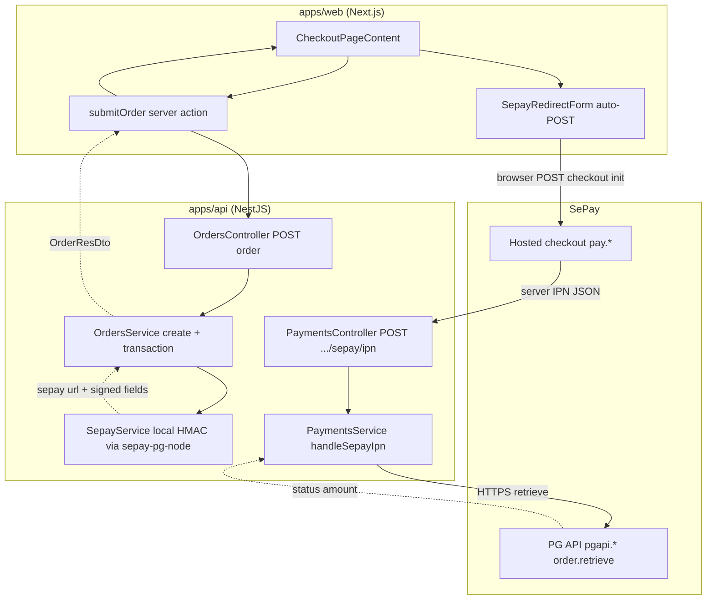
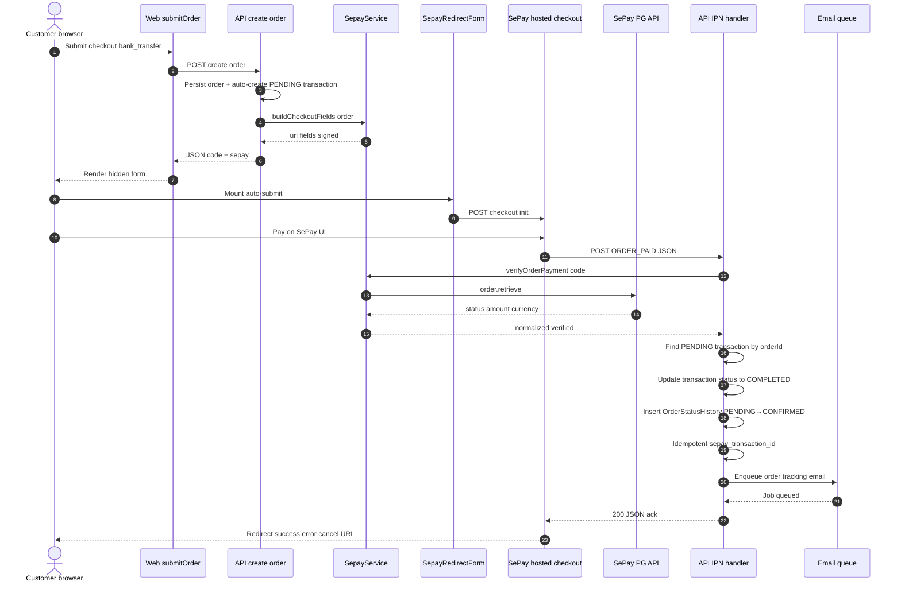
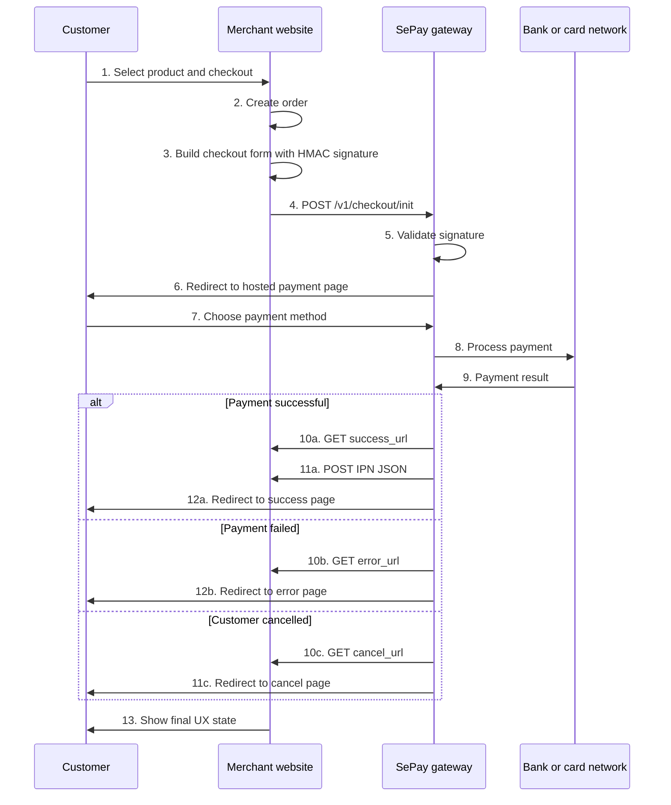

# SePay payment flow (Payment Gateway)

This document describes the **hosted checkout** flow used in this monorepo, aligned with SePay’s Payment Gateway docs under `docs/sepay/`. For embedded **static QR** (`qr.sepay.vn`) plus bank webhooks, see [sepay-qr.md](./sepay-qr.md) — do not combine both patterns on the same checkout screen.

---

## API overview

SePay Payment Gateway supports bank transfer (QR on SePay’s page), NAPAS QR, and cards.

| Environment | Payment Gateway API              | Checkout (form POST target)    |
| ----------- | -------------------------------- | ------------------------------ |
| Production  | `https://pgapi.sepay.vn`         | `https://pay.sepay.vn`         |
| Sandbox     | `https://pgapi-sandbox.sepay.vn` | `https://pay-sandbox.sepay.vn` |

**Authentication:** Gateway APIs use **Basic Auth** with `merchant_id` and `secret_key` (see [sepay-payment-gateway.md](./sepay-payment-gateway.md)).

---

## Diagrams (this monorepo)

### Components and redirect checkout

Who talks to whom when the customer chooses bank transfer.

### End-to-end sequence (repo-aligned)

---

## One-time payment sequence

The customer pays a specific order once; the merchant creates a signed checkout and redirects the browser to SePay.

### Step-by-step (merchant view)

1. Customer checks out on your site.
2. Persist the order (amount, currency, unique invoice / order code).
3. Build signed fields (`merchant`, `operation`, `order_amount`, `currency`, `order_invoice_number`, `order_description`, callback URLs, etc.) and **HMAC-SHA256** signature per SePay rules ([sepay-payment-gateway.md](./sepay-payment-gateway.md)).
4. **POST** the form to SePay’s checkout init URL (production or sandbox).
5. SePay validates the signature.
6. Customer completes payment on SePay (QR banking, NAPAS, card, depending on your enabled methods).
7. SePay processes with the bank or scheme.
8. **Browser redirects** (`success_url` / `error_url` / `cancel_url`) run for **UX only** — they are not a secure financial proof (users can close the tab, bookmarks can be replayed, etc.).
9. **IPN (Instant Payment Notification)** delivers the authoritative JSON payload to your configured server endpoint ([sepay-payment-gateway.md](./sepay-payment-gateway.md) — IPN JSON includes `notification_type`, `order`, `transaction`).
10. Your backend should **acknowledge IPN quickly** (see [sepay-qr.md](./sepay-qr.md): webhook-style handlers often have tight timeouts; defer heavy work to a queue).
11. Customer sees your success / error / cancel pages.

---

## How this monorepo implements it

- **Web** (`apps/web`): Server action creates an order with `paymentMethod: bank_transfer`. The API returns `sepay: { url, fields }`. The client renders **SepayRedirectForm** — a hidden form that **auto-POSTs** to SePay with the signed fields.
- **Quick order** uses the same pattern.
- **After payment**, SePay redirects to `apps/web/src/app/checkout/success|error|cancel`.
- **API** (`apps/api`): SePay **IPN** hits your configured URL (e.g. `POST` payment webhook). The service treats **`ORDER_PAID`** + **`APPROVED`** as candidates, then **re-verifies** the order via the SePay PG SDK (`order.retrieve(order_invoice_number)`) and checks amount/currency before marking the order paid — **idempotent** on `sepay_transaction_id`. After payment confirmation, the handler **enqueues the order tracking email** via BullMQ (sent only after successful payment, not on order creation). See `docs/system-architecture.md` (Payments — SePay).

**Transaction tracking:**

- **Order creation** — When `paymentMethod: bank_transfer` is set, the API auto-creates a PENDING `TransactionEntity` (type=PAYMENT, method=BANK_TRANSFER, status=PENDING) in the same database transaction as the order. This provides an audit trail and enables transaction reconciliation.

- **IPN handler** — On successful payment confirmation, the handler:
  1. Locates the PENDING transaction by order ID
  2. Updates its status to COMPLETED with the SePay transaction ID as reference
  3. Records the payment timestamp (`occurredAt`)
  4. Creates an `OrderStatusHistory` entry for the PENDING→CONFIRMED state transition
  5. Enqueues order tracking email via BullMQ (sent only after payment success)

This ensures every bank transfer order has a corresponding transaction record, enabling financial reporting and reconciliation workflows. Order tracking emails are sent only after payment confirmation, not on order creation.

---

## Best practices (SePay-aligned)

### Security and secrets

- Store **`merchant_id`**, **`secret_key`**, and any **User API / OAuth** credentials in **environment variables** only; never commit them ([sepay-api.md](./sepay-api.md), [sepay-oauth.md](./sepay-oauth.md)).
- **User API tokens** are highly privileged — call **server-side only**, never from the browser ([sepay-api.md](./sepay-api.md)).
- For **bank account webhooks** (SePay → your URL for incoming transfers), prefer **IP allowlisting** and/or **`Authorization: Apikey …`** instead of an open endpoint ([sepay-webhook.md](./sepay-webhook.md)).

### Checkout and signatures

- Include **`success_url`**, **`error_url`**, and **`cancel_url`** in the signed field set as required by the gateway ([sepay-payment-gateway.md](./sepay-payment-gateway.md)).
- Use a **stable, unique** `order_invoice_number` per order; avoid trivially guessable sequences if you also expose payment references elsewhere ([sepay-qr.md](./sepay-qr.md) — same idea for payment codes).

### IPN and order state

- Treat **IPN (and server-side verification)** as the **source of truth** for “paid”. Redirect URLs are for **customer experience** only ([sepay-payment-gateway.md](./sepay-payment-gateway.md)).
- On IPN: validate **`notification_type`** and **`transaction_status`**, then **verify amount and currency** against your order ([sepay-qr.md](./sepay-qr.md) — always match transfer amount to order total; this repo adds gateway **retrieve** verification).
- Respond **`200`** with a small JSON body when the payload is accepted so SePay can stop retries; handle **duplicates** idempotently (same transaction id / invoice).

### Performance and reliability

- Keep the IPN handler **fast**; offload email, ERP, or third-party calls to async workers ([sepay-qr.md](./sepay-qr.md)).
- If you also ingest **bank webhooks** or poll **User API**, plan for **rate limits**: commonly **2 req/s** on User API v2 with **`x-sepay-userapi-retry-after`** on **429** ([sepay-api.md](./sepay-api.md), [sepay-rate-limit.md](./sepay-rate-limit.md)); transaction list reconciliation docs mention **3 req/s** caps — backoff and batch windows ([sepay-list-transactions.md](./sepay-list-transactions.md)).
- Run **periodic reconciliation** (cron) against SePay’s transaction APIs to catch missed webhooks (downtime, timeouts, retry exhaustion) ([sepay-list-transactions.md](./sepay-list-transactions.md)).

### Sandbox and go-live

- Complete **sandbox** flows before switching URLs and keys ([sepay-payment-gateway.md](./sepay-payment-gateway.md)).
- For production: use production **checkout URL**, **merchant credentials**, **IPN URL**, and **callback URLs** together; do not mix sandbox and production in one deployment.

### UX: one payment path per checkout

- With **Payment Gateway**, payment QR and bank selection happen on **SePay’s hosted page**. Do **not** show a separate **static merchant QR** on the same checkout ([sepay-qr.md](./sepay-qr.md)).

### Other SePay products (not this checkout flow)

- **SePay User API v2** — query bank accounts and transactions with **Bearer** token; useful for dashboards and reconciliation ([sepay-api.md](./sepay-api.md)).
- **OAuth2** — partner integrations with scoped access; use **`state`** against CSRF ([sepay-oauth.md](./sepay-oauth.md)).
- **Bank Hub** — hosted bank linking and account events; different base URLs and auth ([sepay-bank-hub.md](./sepay-bank-hub.md)).

---

## Related docs in `docs/sepay/`

| Doc                                                        | Topic                                                 |
| ---------------------------------------------------------- | ----------------------------------------------------- |
| [sepay-payment-gateway.md](./sepay-payment-gateway.md)     | Gateway overview, form fields, IPN sample, go-live    |
| [sepay-webhook.md](./sepay-webhook.md)                     | Bank webhook receiver patterns and auth               |
| [sepay-qr.md](./sepay-qr.md)                               | Embedded QR URL, amount/content checks, response time |
| [sepay-api.md](./sepay-api.md)                             | User API v2, token security, rate limits              |
| [sepay-list-transactions.md](./sepay-list-transactions.md) | Reconciliation, `since_id`, deduplication             |
| [sepay-rate-limit.md](./sepay-rate-limit.md)               | API token and throttling notes                        |
| [sepay-oauth.md](./sepay-oauth.md)                         | OAuth2 authorization code flow                        |

---

### Recurring payment

SePay’s recurring offering is documented as coming soon on the official side; this repo’s storefront flow is **one-time PURCHASE** only until a product update is published.

### Hourly PG sweep (missed IPN)

When IPN delivery fails (timeout, downtime, retry exhaustion), a **BullMQ repeatable job** catches up:

- **Queue:** `sepay-reconcile`, **job:** `sepay-pg-sweep`, **cron:** `0 * * * *` (hourly).
- **Candidate query:** `payment_method=bank_transfer`, `payment_status=pending`, `order_status=pending`, `sepay_transaction_id IS NULL`, `created_at >= now() - 24h`, ordered `ASC`, capped at 200.
- **Per order:** re-verify via `SepayService.verifyOrderPayment(orderCode)` → if CAPTURED/APPROVED + amount/currency match → apply same DB transaction as IPN (order PAID+CONFIRMED, transaction COMPLETED, status history).
- **Safety:** cancelled orders excluded by query + re-read before write. Idempotent on `sepay_transaction_id` unique index. Per-order errors do not fail the sweep.
- **Toggle:** `SEPAY_RECONCILE_ENABLED` env var (default `true`).
- **Design spec:** [features/sepay-pg-reconcile-sweep.md](../features/sepay-pg-reconcile-sweep.md).
